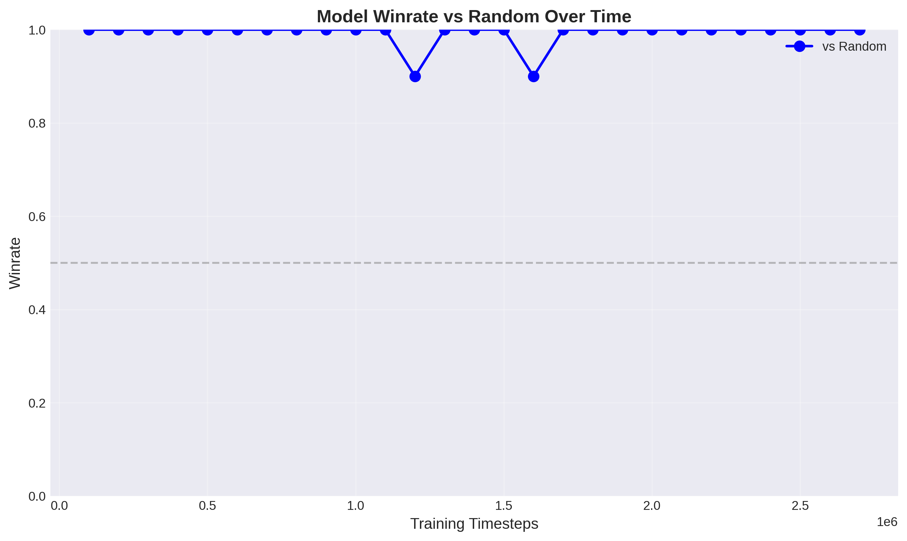
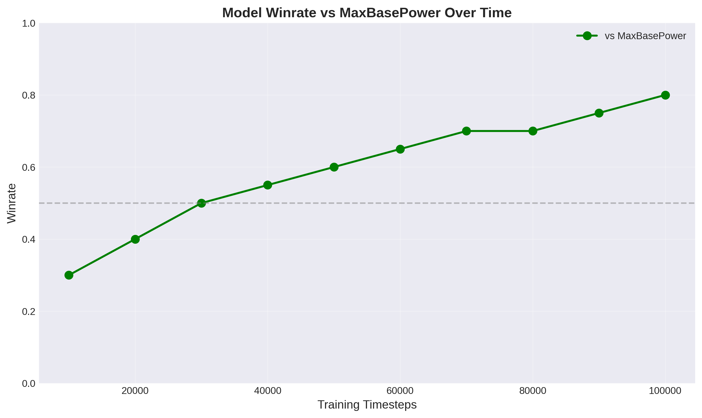
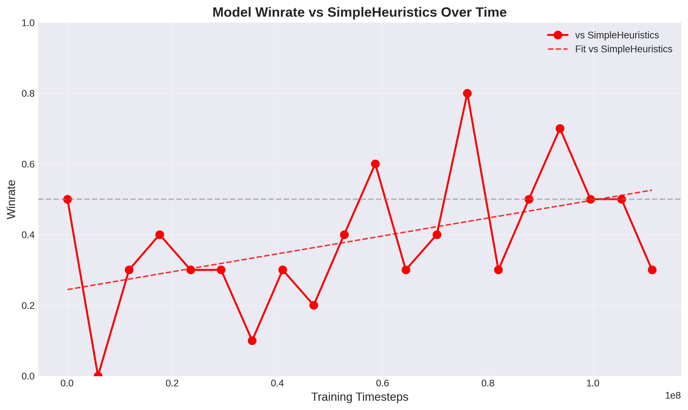

# Calm Mind
Ongoing project to create a strong Pokemon player by Reinforcement Learning.

Training is done by simulating Pokemon battles where the agent plays against itself. Periodically during training the model is evaluated by simulating 10 games versus each of the following 3 strategies: random move selection, max base power move selection, and simple heuristics. (Details of these policies can be found in poke-env/src/player/baselines)

Using proximal policy optimization with learning rate $= 10^{-3}$, $\gamma = 0.9$, and entropy coefficient = $0.05$ the model has started to outperform the max base power strategy at around $5 * 10^7$ training timesteps.

From the below video of the agents play, one can see that move and switch selection is quite good. The agent understand that Aurora veil cannot effectively be used twice, when super effective moves are possible the agent chooses to use them and not very effective moves are seldom used. 

These qualities seem to be sufficient to beating the strategy of simply clicking the strongest move every time. However, the model's winrate versus the policy relying on heuristics is still poor and it would be unreasonable to expect the model to perform well versus real human players yet. From the replays one can also gleam that the model hasn't yet learned how to fully utilize the terrastalization mechanic. 

Note on limitations: to save on compute, early testing is done with 1 fixed team of pokemon. Having success with a randomly generated team is the ultimate goal.
