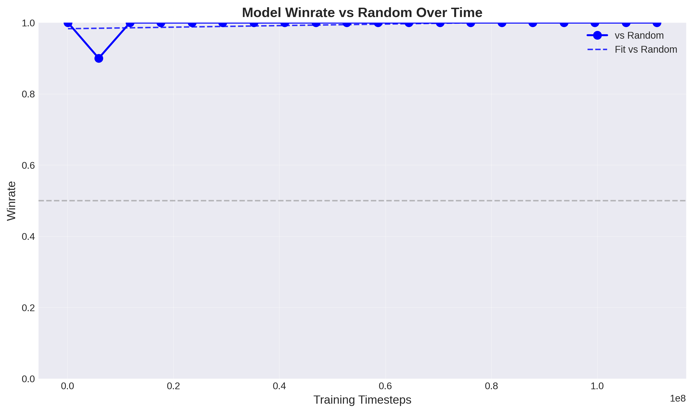
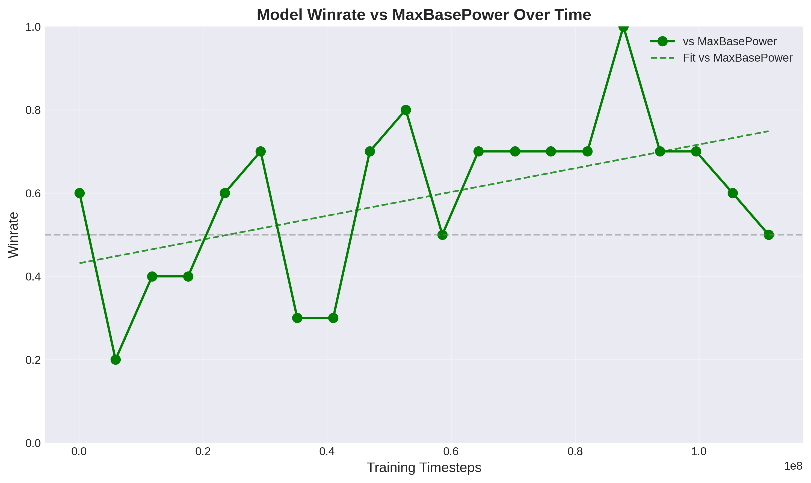

# Calm Mind
Ongoing project to create a strong Pokemon player by Reinforcement Learning.

Training is done by simulating Pokemon battles against 3 different policies: one that selects the highest base power move all the time, one that plays on simple heuristics (details can be seen from poke-env/src/player/baselines), and self-play. Periodically during training the model is evaluated by simulating 10 games versus each of the following 3 strategies: random move selection, max base power move selection, and simple heuristics. 

Using proximal policy optimization with learning rate $= 10^{-3}$ and $\gamma = 0.99$ the model has not converged to a policy that consistently outperforms all 3 strategies within 4.7 * 10^6 timesteps.

Results may improve with further training, however at this point (25.10.2025) I will inspect if tuning the hyperparameters could yield to faster convergence.

Inspecting some of the replays in eval_results/repalys one can clearly see that the model is having a hard time learning how to use the moves Wish and Protect. By nature of how gradient updates are made (either all actions in an episode were good, or they were all bad) it is very hard to learn that a move cannot be effectively used 2 turns in a row. 

Note on limitations: to save on compute, early testing is done with 1 fixed team of pokemon. Having success with a randomly generated team is the ultimate goal.